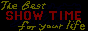

    <kbd>
        
    </kbd>
    <h2>  Hey, I'm Aleksey.  </h2>

###

    
  Here you'll find my projects, experiments and work. 

    
  I'm passionate about development, love exploring new technologies and enjoy sharing my knowledge. 

    
  I want to move forward and get more experience. Also, I love programming, music and traveling. Teamwork is what I enjoy the most, but I do not mind working by myself. 

    
  Feel free to reach out with any questions, suggestions or collaboration ideas! 

###

    <h3> Get In Touch </h3>
    <kbd>
        
        
    </kbd>

###

    <h3> What I Work With </h3>
    <kbd>
        
        
        
        
        
    </kbd>
    ...and many others 

###

    <table>
        <tr>
            <th> 
                <picture>
                    <source
                        srcset="https://github-readme-stats.vercel.app/api/top-langs/?username=AlekseyShashkov&layout=compact&theme=transparent&hide_border=true&text_color=FFFFFF&title_color=61dafb"
                        media="(prefers-color-scheme: dark)" />
                    <source
                        srcset="https://github-readme-stats.vercel.app/api/top-langs/?username=AlekseyShashkov&layout=compact"
                        media="(prefers-color-scheme: light), (prefers-color-scheme: no-preference)" />
                    
                </picture>
            </th>
            <th>       
                <picture>
                    <source
                        srcset="https://github-readme-stats.vercel.app/api?username=AlekseyShashkov&theme=transparent&hide_border=true&text_color=FFFFFF&show_icons=true&icon_color=61dafb&title_color=61dafb"
                        media="(prefers-color-scheme: dark)" />
                    <source
                        srcset="https://github-readme-stats.vercel.app/api?username=AlekseyShashkov&show_icons=true"
                        media="(prefers-color-scheme: light), (prefers-color-scheme: no-preference)" />
                    
                </picture>
            </th>
        </tr>
    </table>

###

    <kbd>       
             
        
         
          
        
        
        
                
    </kbd>

